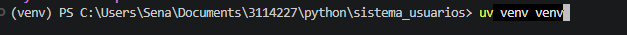
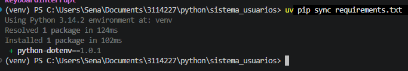
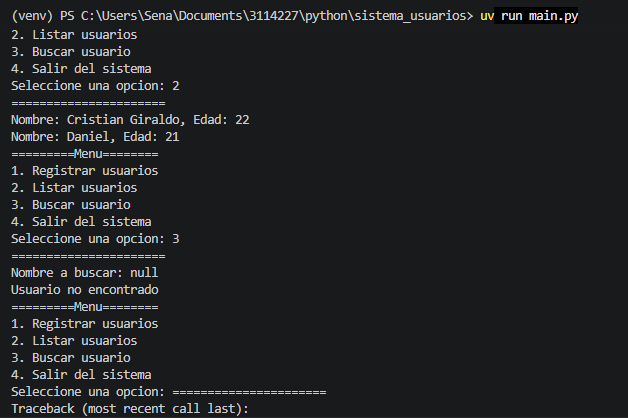
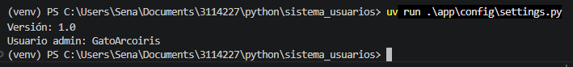
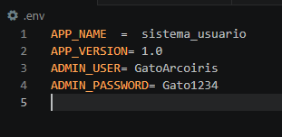
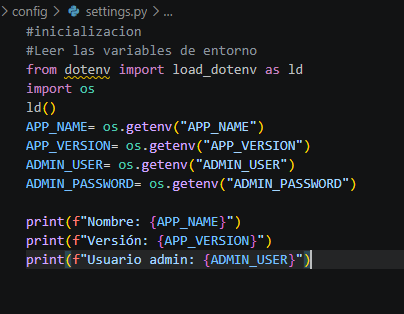

# Sistema de Usuarios

GFPI-F-135 V04

## Tabla de Contenidos

- [Requisitos del Sistema](#requisitos-del-sistema)
- [Creacion del Entorno Virtual](#creacion-del-entorno-virtual)
- [Instalacion de Dependencias](#instalacion-de-dependencias)
- [Ejecucion del Proyecto](#ejecucion-del-proyecto)
- [Variables de Entorno](#variables-de-entorno)
- [Estructura del Proyecto](#estructura-del-proyecto)
- [Capturas de Pantalla](#capturas-de-pantalla)
- [Estrategias o Tecnicas Didacticas Activas](#estrategias-o-tecnicas-didacticas-activas)
- [Materiales de Formacion](#materiales-de-formacion)
- [Evidencias de Aprendizaje](#evidencias-de-aprendizaje)
- [Reflexion Final](#reflexion-final)

## Requisitos del Sistema

- Ambiente presencial o virtual con acceso a internet.
- Computador con Python instalado (version 3.12 o superior).
- Visual Studio Code o editor similar.
- Git y GitHub.
- Terminal de comandos.
- Gestor de dependencias UV.

## Creacion del Entorno Virtual

Ejecute el siguiente comando en la raiz del proyecto:

```powershell
uv venv
```

Este comando crea una carpeta llamada `.venv` que contiene una copia aislada de Python. Todas las dependencias se instalaran ahi sin afectar el sistema.



## Instalacion de Dependencias

Con el entorno virtual creado, ejecute:

```powershell
uv pip sync requirements.txt
```

Este comando lee el archivo `requirements.txt` e instala exactamente las versiones indicadas de cada dependencia.



## Ejecucion del Proyecto

Para ejecutar el sistema principal:

```powershell
uv run main.py
```

Esto inicia el menu interactivo donde puede registrar usuarios, listarlos y buscarlos.



Para ver la configuracion del sistema (variables de entorno):

```powershell
uv run python -m app.config.settings
```



## Variables de Entorno

El proyecto utiliza un archivo `.env` para almacenar configuraciones como el nombre de la aplicacion, la version y credenciales de administrador. Esto evita escribir datos sensibles directamente en el codigo.

El archivo `.env.example` contiene un ejemplo de las variables necesarias:

```
APP_NAME=sistema_usuario
APP_VERSION=1.0
ADMIN_USER=GatoArcoiris
ADMIN_PASSWORD=Gato1234
```

Para usar variables de entorno en su propio equipo:

1. Copie `.env.example` como `.env`.
2. Modifique los valores segun sea necesario.
3. El archivo `.env` no se sube a GitHub (esta en `.gitignore`).

La carga de estas variables la realiza el modulo `app/config/settings.py` usando la libreria `python-dotenv`.




## Estructura del Proyecto

```
sistema_usuarios/
├── app/
│   ├── __init__.py          -- Marca la carpeta app como un paquete de Python.
│   ├── config/
│   │   ├── __init__.py      -- Exporta las variables de configuracion.
│   │   └── settings.py      -- Carga y expone las variables de entorno.
│   └── usuarios/
│       ├── __init__.py      -- Exporta DataBase, validar_datos y ValidacionError.
│       ├── gestor.py        -- Clase DataBase: simula una base de datos en memoria.
│       └── validaciones.py  -- Excepciones y funciones para validar datos de entrada.
├── .env                     -- Variables de entorno (no se sube a GitHub).
├── .env.example             -- Ejemplo del archivo .env.
├── .gitignore               -- Archivos ignorados por Git.
├── requirements.txt         -- Dependencias del proyecto.
├── main.py                  -- Punto de entrada del programa (menu interactivo).
└── README.md                -- Documentacion del proyecto.
```

### Explicacion de los paquetes

**Paquete app/config**: Encargado de la configuracion general. El archivo `settings.py` lee las variables del archivo `.env` usando la libreria `python-dotenv` y las pone a disposicion del resto del proyecto. El `__init__.py` exporta directamente estas variables para que se puedan importar de forma limpia.

**Paquete app/usuarios**: Contiene la logica del sistema. El archivo `gestor.py` define la clase `DataBase` que almacena usuarios en una lista y permite registrarlos, listarlos y buscarlos. El archivo `validaciones.py` define excepciones personalizadas y funciones que validan el nombre y la edad antes de registrar un usuario. El `__init__.py` exporta los elementos principales para facilitar las importaciones desde otros archivos.

**Archivo main.py**: Es el punto de entrada. Muestra un menu en consola con cuatro opciones: registrar usuario, listar usuarios, buscar usuario y salir. Captura los errores de validacion y muestra mensajes claros al usuario.

## Capturas de Pantalla

Las siguientes capturas muestran el funcionamiento del proyecto:

| Captura | Descripcion |
|---|---|
| `images/crearVenv.png` | Creacion del entorno virtual con uv. |
| `images/sync.png` | Instalacion de dependencias con uv pip sync. |
| `images/ejecucionSistema.png` | Menu principal del sistema en funcionamiento. |
| `images/runSettings.png` | Ejecucion del modulo de configuracion. |
| `images/variablesEntorno.png` | Contenido del archivo .env y su carga. |

## Estrategias o Tecnicas Didacticas Activas

- Aprendizaje basado en retos.
- Desarrollo de proyecto integrador.
- Modularizacion de software.
- Resolucion de problemas practicos.
- Retroalimentacion colaborativa.

## Materiales de Formacion

- Gestion de dependencias con UV.
- Gestion de dependencias con pip y requirements.txt.
- Entornos virtuales (virtualenv, venv).
- Variables de entorno con python-dotenv.
- Creacion de modulos y paquetes.
- Importacion de modulos y paquetes.

## Evidencias de Aprendizaje

Repositorio individual en GitHub con:

- Proyecto funcional.
- Entorno virtual configurado.
- requirements.txt.
- Archivo .env.example.
- README.md documentado.

## Reflexion Final

[Enlace al video de YouTube sobre ventajas de modularizar, importancia de aislar dependencias y uso seguro de variables de entorno.]
